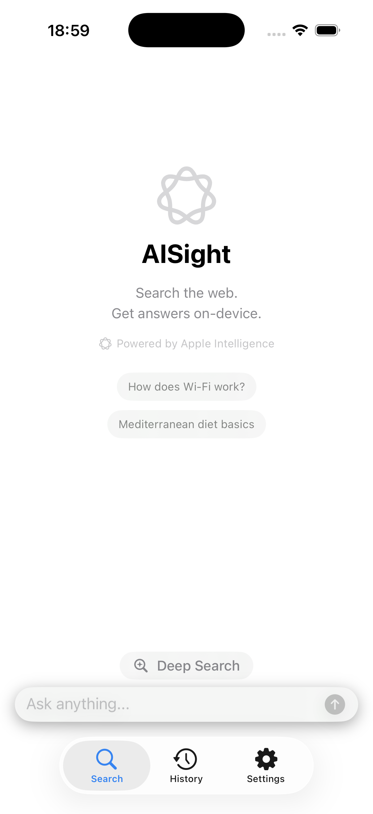
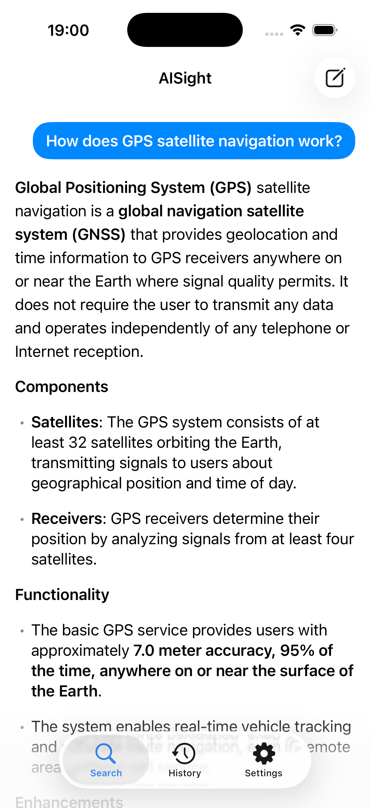
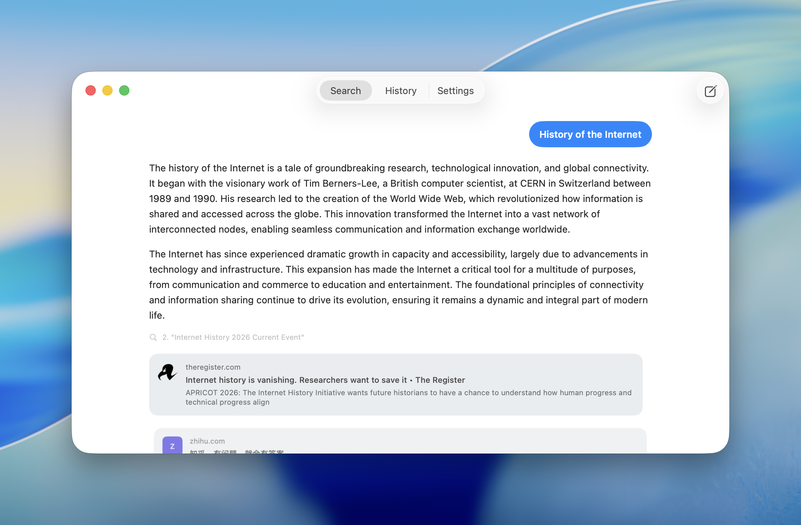

<p align="center">
  
</p>

<h1 align="center">AISight</h1>

<p align="center">
  <em>The private alternative to Perplexity.</em><br>
  Search the web. Get answers on-device.
</p>

<p align="center">
  <a href="LICENSE"></a>
  
  
  
</p>

<p align="center">
  <!-- TODO: Replace with App Store link when available -->
  
</p>

<p align="center">
  
  &nbsp;&nbsp;
  
</p>
<p align="center">
  
</p>

---

A native iOS 26 / macOS 26 answer engine that combines web search with on-device AI. AISight searches the web via a self-hosted [SearXNG](https://github.com/searxng/searxng) instance and synthesizes answers using Apple's FoundationModels framework (Apple Intelligence) — all AI processing happens privately on your device. Zero external dependencies.

## Why?

Every major answer engine — Perplexity, Google AI Overviews, Bing Copilot — sends your queries to cloud AI services, building a profile of what you search. AISight takes a different approach: the AI runs entirely on your device via Apple Intelligence, so your questions never leave your phone or Mac. You control the search backend too (self-hosted SearXNG), meaning no single company sees both what you search and what you ask about it. It's the answer engine for people who think privacy shouldn't be a premium feature.

## Features

- Answer factual, encyclopedic, and "how-to" questions with cited sources
- **Deep Search** — multiple AI research passes for complex questions (Pro)
- Search the web via SearXNG (aggregates Google, Bing, Brave, and more)
- On-device AI synthesis — your data never leaves to a cloud AI service
- Stream responses token by token with inline citations
- Reciprocal Rank Fusion (RRF) for multi-engine result ranking
- Persist query history locally via SwiftData
- Universal app — runs natively on iPhone, iPad, and Mac

## What it cannot do

- Multi-hop reasoning beyond Deep Search (on-device model is ~3B parameters)
- Real-time news with high freshness guarantees
- Complex math or coding assistance
- Image understanding (text-only)
- Work without internet (search requires connectivity)
- Run on devices older than iPhone 15 Pro / iOS 26

## Requirements

- **Xcode 26+** (beta)
- iOS 26.0 / macOS 26.0 deployment target
- Apple Intelligence enabled on device
- A SearXNG instance (local Docker or remote)

## Quick Start

### 1. Set up SearXNG (local development)

A Docker Compose setup is included for local development:

```bash
cd searxng
docker compose up -d
```

This starts SearXNG on `http://localhost:8888` with Google, Bing, Brave, and Wikipedia enabled.

For production, deploy your own instance following the [SearXNG Docker guide](https://github.com/searxng/searxng-docker).

### 2. Configure and build

1. Open `AISight/AISight.xcodeproj` in Xcode 26
2. The default SearXNG URL is `http://localhost:8888` — change it in `AISight/App/AppConfig.swift` if needed
3. Select your target (iPhone simulator or My Mac) and **Cmd+R**

> **macOS note:** Add the "Outgoing Connections (Client)" capability in Signing & Capabilities for network access.

> **Physical device note:** Replace `localhost` with your Mac's local IP in the app's Settings tab.

## Architecture

```
User Query → SearXNG (search) → ContentFetcher (HTML→text) → FoundationModels (on-device AI) → Streamed Answer with Citations → SwiftData (history)
```

| Layer | Path | Responsibility |
|-------|------|---------------|
| App | `AISight/App/` | Entry point, config, global state |
| Core/AI | `AISight/Core/AI/` | FoundationModels session, Deep Search pipeline |
| Core/Search | `AISight/Core/Search/` | SearXNG API client, RRF ranking, models |
| Core/Fetching | `AISight/Core/Fetching/` | URL → clean text extraction |
| Core/Persistence | `AISight/Core/Persistence/` | SwiftData models and store |
| Features | `AISight/Features/` | Search, History, Onboarding, Settings |
| UI/Components | `AISight/UI/Components/` | CitationText, SourceCard, etc. |

**Tech stack:** Swift 6, SwiftUI, FoundationModels, SwiftData, URLSession. No external packages.

## Privacy

All AI inference runs on-device via Apple Intelligence. Data that leaves your device:
1. Search queries sent to your SearXNG instance
2. HTTP requests to source URLs for content fetching

No analytics. No tracking. No third-party AI services.

## Topics

`privacy-first` `perplexity-alternative` `local-ai` `no-tracking` `on-device-ai` `apple-intelligence` `searxng` `answer-engine` `swiftui` `ios` `macos` `swift`

## License

[MIT](LICENSE)
